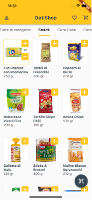
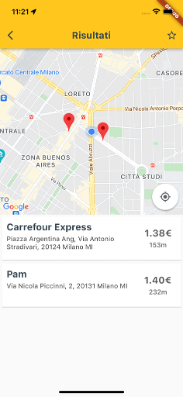
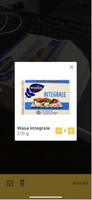
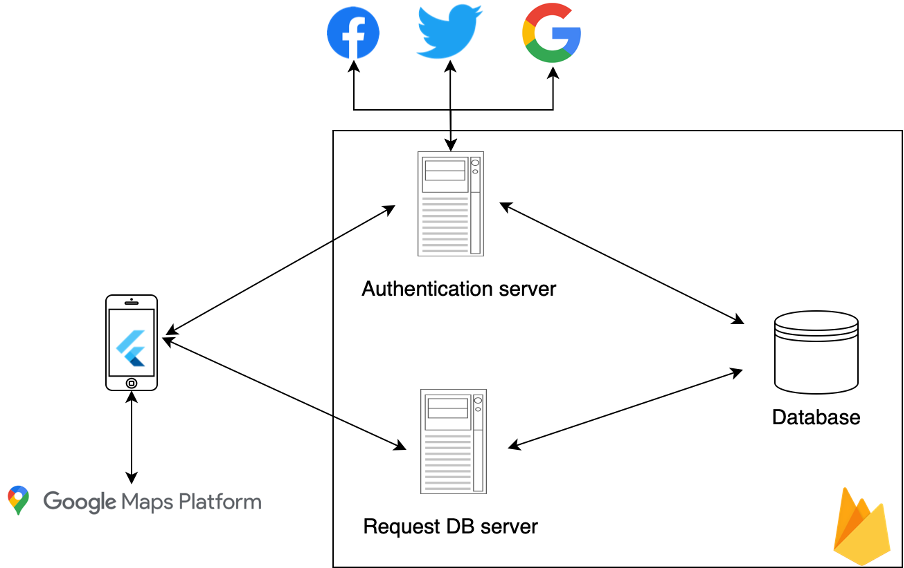

# OptiShop 🛒

**OptiShop** is a cross-platform mobile app that helps users **optimize everyday shopping**.  
It allows you to build a shopping cart and then suggests the nearby markets that minimize the total cost while considering both **price** and **distance**.


## 🚀 Features

- **Account management**: register/login via email & password or social accounts (Google, Facebook, Twitter).  
- **Product catalog**: browse products by categories with images, details, and EAN codes.  
- **Cart & Favorites**: add/remove products, save shopping lists, reuse favorites.  
- **Scanner**: scan a product’s EAN barcode and add it directly to the cart.  
- **Optimization algorithm**: rank markets based on user location + total cart price.  
- **Map integration**: visualize results on Google Maps with markers for each store.  
- **Settings**: change profile info, password, search radius, or logout.  
- **Cross-platform**: works on both **iOS** and **Android**, responsive layouts for phones and tablets.


<p align="center">
  
  
  
  
</p>

## 🛠️ Tech Stack

- **Flutter** – cross-platform UI framework.  
- **Firebase Authentication** – handles registration/login with email or third-party providers.  
- **Firebase Firestore** – NoSQL database for products, markets, users, favorites.  
- **Firebase Storage** – stores images of products and categories with secure access rules.  
- **Google Maps Platform** – location services, geocoding, and visualization of markets.  
- **Provider** – state management (Authentication, UserData, Cart, Products, Results).  

## 📐 Architecture



OptiShop is a **fat client** app: the mobile client handles most logic (ranking, cart, favorites) and interacts with Firebase only for storage and authentication.  

### Components

- **Authentication Provider**: manages login state and injects credentials into other providers.  
- **UserData Provider**: stores user profile info, preferences, and saved searches.  
- **Data Provider**: fetches products and categories, keeps data in sync with Firestore.  
- **Cart Provider**: manages cart contents, add/remove items.  
- **Result Provider**: runs the **ranking algorithm** and fetches corresponding market data.  

### Database Structure (Firestore)

- `/categories/{category_id}` → name, image  
- `/products/{product_id}` → name, EAN, description, image, category  
- `/markets/{market_id}` → name, address, position (geohash + geopoint), products {product_id: price}  
- `/users/{user_id}` → profile data, distance radius  
- `/user-preferences/{preference_id}` → saved carts  


## 📊 Optimization Algorithm

The algorithm ranks markets by combining:  

1. **Location constraint**: only markets within the user’s preferred radius.  
2. **Product availability**: market must contain *all* items from the cart.  
3. **Price aggregation**: compute total cart cost at each market.  
4. **Ranking**: order markets ascending by total price, ties broken by distance.  

This provides the user with both the **cheapest** and the **most convenient** options nearby.

## 📍 Localization

- **GPS location** is retrieved from the device with user permission.  
- Markets are stored with **latitude/longitude** and a **geohash** for efficient spatial queries.  
- Distance calculation uses Google Maps APIs to ensure accuracy.  
- Results are displayed as an **ordered list** and visually on a map with **interactive markers**.


## 🎨 UI/UX

- Responsive layouts for **portrait/landscape** and **phone/tablet**.  
- Reusable widgets for buttons, dialogs, cards, expandable FABs.  
- Dynamic home page with category tabs → product lists.  
- Scanner with flashlight/camera switch controls.  
- Favorites page split view on tablet (list on left, details on right).

## 🧪 Testing

### Scope
- **Functional testing**: providers, async flows, state consistency.  
- **Widget testing**: independent page rendering and interactions.  
- **Integration testing**: complete flows (login, shopping, favorites, settings).  

### Tools
- `fake_cloud_firestore`, `firebase_auth_mock`, `firebase_storage_mock`  
- `mockito` for mocking complex dependencies.  

### Coverage
- Unit tests: models + providers (≈79% line coverage).  
- Widget tests: UI pages (≈75% coverage).  
- Integration tests: navigation flows (login, cart, favorites).  


## 📂 Project Structure

```

lib/
├── models/         # Data models (User, Product, Market, Category, Preference)
├── providers/      # State management (auth, cart, data, result, user data)
├── ui/             # Pages and widgets
│   ├── authenticated/   # pages for logged-in users
│   ├── unauthenticated/ # login/signup/recover pages
│   └── widgets/         # reusable UI components
├── main.dart       # App entry point
├── optishop.dart   # Root widget + provider setup

```
